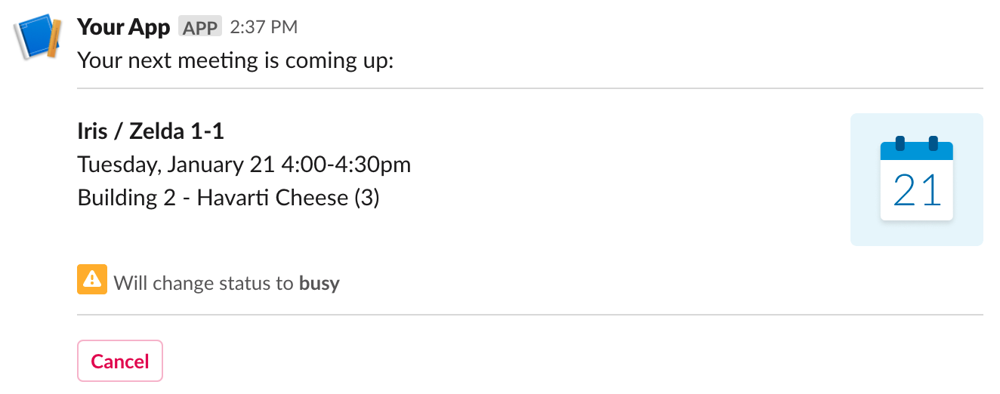

# DataWeave Slack Module


This module provides constructs to simplify working with Slack's blocks. Types can be used to get guidance and validation
when writing complex block structures while builder functions help keep code lean by taking care of all boilerplate code.

Consider [this](https://app.slack.com/block-kit-builder/TLK2W2W10#%7B%22blocks%22:%5B%7B%22type%22:%22section%22,%22text%22:%7B%22type%22:%22plain_text%22,%22text%22:%22Your%20next%20meeting%20is%20coming%20up:%22,%22emoji%22:true%7D%7D,%7B%22type%22:%22divider%22%7D,%7B%22type%22:%22section%22,%22text%22:%7B%22type%22:%22mrkdwn%22,%22text%22:%22*Iris%20/%20Zelda%201-1*%5CnTuesday,%20January%2021%204:00-4:30pm%5CnBuilding%202%20-%20Havarti%20Cheese%20(3)%22%7D,%22accessory%22:%7B%22type%22:%22image%22,%22image_url%22:%22https://api.slack.com/img/blocks/bkb_template_images/notifications.png%22,%22alt_text%22:%22calendar%22%7D%7D,%7B%22type%22:%22context%22,%22elements%22:%5B%7B%22type%22:%22image%22,%22image_url%22:%22https://api.slack.com/img/blocks/bkb_template_images/notificationsWarningIcon.png%22,%22alt_text%22:%22warning%20icon%22%7D,%7B%22type%22:%22mrkdwn%22,%22text%22:%22Will%20change%20status%20to%20*busy*%22%7D%5D%7D,%7B%22type%22:%22divider%22%7D,%7B%22type%22:%22actions%22,%22elements%22:%5B%7B%22type%22:%22button%22,%22text%22:%7B%22type%22:%22plain_text%22,%22text%22:%22Cancel%22,%22emoji%22:true%7D,%22action_id%22:%22cancel-meeting%22,%22style%22:%22danger%22%7D%5D%7D%5D%7D)
59 line block kit JSON to generate this message:


With the DataWeave Slack module you can generate it with this simple script that can be quickly refactored into a dynamic version:
```dataweave
%dw 2.0
import * from org::mule::weave::slack::modules::Builders
output application/json
var calendar = image("https://api.slack.com/img/blocks/bkb_template_images/notifications.png", "calendar")
---
blocks([
    section(text("Your next meeting is coming up:")),
    divider(),
    section("*Iris / Zelda 1-1*\nTuesday, January 21 4:00-4:30pm\nBuilding 2 - Havarti Cheese (3)", calendar),
    context([
        image("https://api.slack.com/img/blocks/bkb_template_images/notificationsWarningIcon.png", "warning icon"),
        mrkdwn("Will change status to *busy*")
    ]),
    divider(),
    actions([button("Cancel", "cancel-meeting") withStyle "danger"])
])
```

## [org::mule::weave::slack::modules::Blocks](pages/Blocks.md )

Representation of all Slack [blocks](https://api.slack.com/reference/block-kit/blocks):

### Types
| Name | Description|
|------|------------|
|[Actions](pages/Blocks.md/#actions- ) | Represents an action block.|
|[Block](pages/Blocks.md/#block- ) | Generic representation of a block.|
|[Context](pages/Blocks.md/#context- ) | Represents a context block.|
|[Divider](pages/Blocks.md/#divider- ) | Represents a divider block.|
|[File](pages/Blocks.md/#file- ) | Represents a file block.|
|[Header](pages/Blocks.md/#header- ) | Represents a header block.|
|[ImageBlock](pages/Blocks.md/#imageblock- ) | Represents an image block.|
|[Input](pages/Blocks.md/#input- ) | Represents an input block.|
|[OptionalId](pages/Blocks.md/#optionalid- ) | Helper type to reuse block IDs|
|[Section](pages/Blocks.md/#section- ) | Helper type to encapsulate fields|
|[WithFields](pages/Blocks.md/#withfields- ) | Helper type to encapsulate fields|
|[WithText](pages/Blocks.md/#withtext- ) | Helper type to reuse text|

________________________________


## [org::mule::weave::slack::modules::Builders](pages/Builders.md )

Provides functions to simplify the creation and composition of [blocks](https://api.slack.com/block-kit), [elements](https://api.slack.com/reference/block-kit/block-elements) and [objects](https://api.slack.com/reference/block-kit/composition-objects):

### Functions
| Name | Description|
|------|------------|
| [actions](pages/Builders.md/#actions- ) | Generates an actions block.|
| [blocks](pages/Builders.md/#blocks- ) | Generates the standard block kit syntax to define a group of blocks.|
| [button](pages/Builders.md/#button- ) | Generates a button element, with a simple plain text<br> object and ID.|
| [buttonWithUrl](pages/Builders.md/#buttonwithurl- ) | Generates a button element, with a simple plain text object, an ID and an URL.|
| [buttonWithValue](pages/Builders.md/#buttonwithvalue- ) | Generates a button element, with a simple plain text object, an ID and a value.|
| [context](pages/Builders.md/#context- ) | Generates a context block with a single plain text element item.|
| [divider](pages/Builders.md/#divider- ) | Generates a divider block.|
| [externalSelect](pages/Builders.md/#externalselect- ) | Generates an external select element, with a simple plain text object as placeholder and its ID.|
| [header](pages/Builders.md/#header- ) | Generates a header block, with a simple plain text object.|
| [image](pages/Builders.md/#image- ) | Generates an image element, with its URL and alternative text.|
| [inputBlock](pages/Builders.md/#inputblock- ) | Generates an input block with a simple text label.|
| [inputText](pages/Builders.md/#inputtext- ) | Generates an input object.|
| [mrkdwn](pages/Builders.md/#mrkdwn- ) | Generates a mrkdwn text object.|
| [multiStaticSelect](pages/Builders.md/#multistaticselect- ) | Generates a multi static select element, with a simple text placeholder, ID and options.|
| [option](pages/Builders.md/#option- ) | Generates an option object, with a simple plain text<br> object and its value.|
| [optionGroup](pages/Builders.md/#optiongroup- ) | Generates an option group object, with a simple plain text object and its options.|
| [radioButtons](pages/Builders.md/#radiobuttons- ) | Generates a radio buttons group, given its ID and options.|
| [section](pages/Builders.md/#section- ) | Generates a simple section block, with a mrkdwn object.|
| [staticSelect](pages/Builders.md/#staticselect- ) | Generates a static select element, with a simple plain text object as placeholder, its ID and options.|
| [staticSelectByGroups](pages/Builders.md/#staticselectbygroups- ) | Generates a static select element, with a simple plain text object as placeholder, its ID and option groups.|
| [text](pages/Builders.md/#text- ) | Generates a plain text object, with emojis enabled.|
| [withStyle](pages/Builders.md/#withstyle- ) | Adds a style field to a button.|
| [withUrl](pages/Builders.md/#withurl- ) | Adds a url field to a button.|
| [withValue](pages/Builders.md/#withvalue- ) | Adds a value field to a button.|

________________________________


## [org::mule::weave::slack::modules::Elements](pages/Elements.md )

Representation of all Slack [elements](https://api.slack.com/reference/block-kit/block-elements):

### Types
| Name | Description|
|------|------------|
|[Button](pages/Elements.md/#button- ) | Represents a button element.|
|[Checkbox](pages/Elements.md/#checkbox- ) | Represents a checkbox group element.|
|[ConversationsList](pages/Elements.md/#conversationslist- ) | Represents a conversation list.|
|[DatePicker](pages/Elements.md/#datepicker- ) | Represents a datepicker element.|
|[Element](pages/Elements.md/#element- ) | Represents a block element.|
|[ExternalSelect](pages/Elements.md/#externalselect- ) | Represents an external select menu.|
|[Image](pages/Elements.md/#image- ) | Represents an image element.|
|[MultiConversationList](pages/Elements.md/#multiconversationlist- ) | Represents a multi conversation list.|
|[MultiExternalSelect](pages/Elements.md/#multiexternalselect- ) | Represents an external multi select menu.|
|[MultiPublicChannelsList](pages/Elements.md/#multipublicchannelslist- ) | Represents a channel list.|
|[MultiSelect](pages/Elements.md/#multiselect- ) | Helper type to reuse multi selection|
|[MultiSelectMenu](pages/Elements.md/#multiselectmenu- ) | Represents all multi select menus.|
|[MultiStaticSelect](pages/Elements.md/#multistaticselect- ) | Represents a static multi select menu.|
|[MultiUserList](pages/Elements.md/#multiuserlist- ) | Represents a multi user list.|
|[OverflowMenu](pages/Elements.md/#overflowmenu- ) | Represents an overflow menu.|
|[PlainTextInput](pages/Elements.md/#plaintextinput- ) | Represents a plain text input.|
|[PublicChannelsList](pages/Elements.md/#publicchannelslist- ) | Represents a channel list.|
|[RadioButtonGroup](pages/Elements.md/#radiobuttongroup- ) | Represents a radio button group.|
|[Select](pages/Elements.md/#select- ) | Helper type to reuse selection|
|[SelectMenu](pages/Elements.md/#selectmenu- ) | Represents all select menus.|
|[StaticSelect](pages/Elements.md/#staticselect- ) | Represents a static select menu.|
|[TimePicker](pages/Elements.md/#timepicker- ) | Represents a timepicker element.|
|[UserList](pages/Elements.md/#userlist- ) | Represents a user list.|
|[WithOptionalConfirm](pages/Elements.md/#withoptionalconfirm- ) | Helper type to reuse confirm option|

________________________________


## [org::mule::weave::slack::modules::Objects](pages/Objects.md )

Representation of all Slack [objects](https://api.slack.com/reference/block-kit/composition-objects):

### Types
| Name | Description|
|------|------------|
|[Confirmation](pages/Objects.md/#confirmation- ) | Represents a confirm dialog object.|
|[Dispatch](pages/Objects.md/#dispatch- ) | Represents a dispatch action object.|
|[DispatchOptions](pages/Objects.md/#dispatchoptions- ) | Represents the possible options of a dispatch action object.|
|[Filter](pages/Objects.md/#filter- ) | Represents a filter conversation object.|
|[FilterOptions](pages/Objects.md/#filteroptions- ) | Represents the possible options of a filter conversation object.|
|[Mrkdwn](pages/Objects.md/#mrkdwn- ) | Represents an exclusively mrkdwn object.|
|[Option](pages/Objects.md/#option- ) | Represents an option object.|
|[OptionGroup](pages/Objects.md/#optiongroup- ) | Represents an option group object.|
|[PlainText](pages/Objects.md/#plaintext- ) | Represents an exclusively plain object.|
|[SimpleText](pages/Objects.md/#simpletext- ) | Helper type to represent text objects.|
|[Style](pages/Objects.md/#style- ) | Represent the possible style options|
|[Text](pages/Objects.md/#text- ) | Represents a text object.|
|[WithOptionGroup](pages/Objects.md/#withoptiongroup- ) | Helper type to compose option groups|
|[WithOptions](pages/Objects.md/#withoptions- ) | Helper type to compose options|
________________________________
